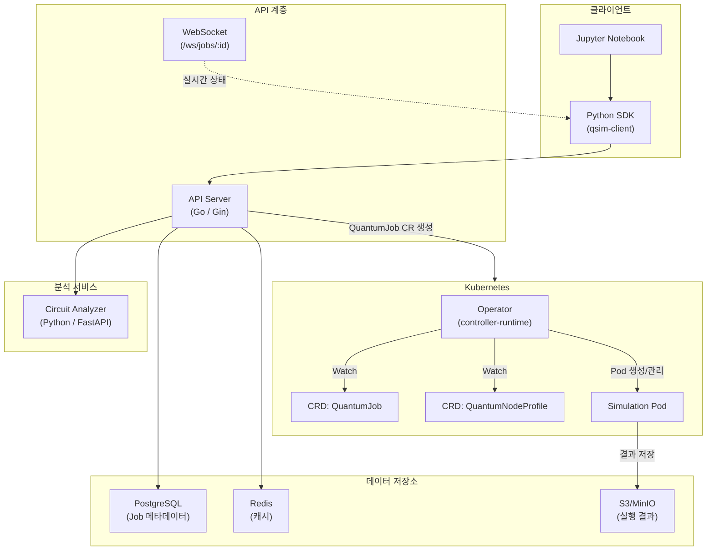
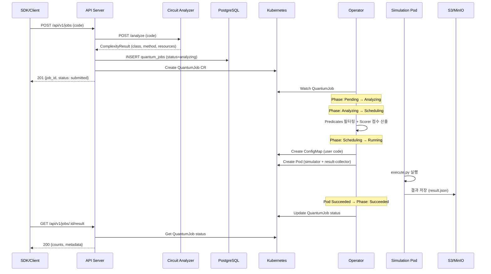

# 아키텍처 문서

## 시스템 개요

qsim-cluster는 Kubernetes 기반의 양자 회로 시뮬레이션 클러스터입니다. 회로 복잡도 분석을 통한 지능형 스케줄링과 리소스 최적화를 제공합니다.



## 컴포넌트별 설명

### API Server (`api-server/`)

- **언어/프레임워크**: Go 1.21+, Gin, Cobra, Viper
- **역할**: REST API 제공, Job 생명주기 관리, K8s 리소스 CRUD
- **주요 의존성**: PostgreSQL (Job 저장), Redis (캐시), Analyzer (회로 분석), K8s Dynamic Client (CRD 관리)
- **포트**: 8080

| 패키지 | 설명 |
|--------|------|
| `cmd/server/main.go` | 엔트리포인트, 설정 초기화, graceful shutdown |
| `internal/api/router.go` | Gin 라우터 및 핸들러 등록 |
| `internal/api/handlers/` | Job, Cluster, Analysis, WebSocket 핸들러 |
| `internal/api/middleware/` | Logger, Recovery, CORS, Auth 미들웨어 |
| `internal/store/` | PostgreSQL (JobStore), Redis (CacheStore) 구현 |
| `internal/k8s/client.go` | K8s clientset + dynamic client 래퍼 |
| `internal/analyzer/client.go` | Analyzer 서비스 HTTP 클라이언트 |

### Operator (`operator/`)

- **언어/프레임워크**: Go 1.21+, controller-runtime (kubebuilder)
- **역할**: QuantumJob과 QuantumNodeProfile CRD의 Reconciliation Loop 관리
- **그룹**: `quantum.blocksq.io/v1alpha1`

| 패키지 | 설명 |
|--------|------|
| `api/v1alpha1/` | CRD Go 타입 정의 (QuantumJob, QuantumNodeProfile) |
| `internal/controller/` | Reconciler 구현 (Job 상태 머신, NodeProfile 상태 업데이트) |
| `internal/scheduler/` | Predicates (노드 필터링), Scorer (노드 점수 산출) |
| `internal/runtime/` | PodBuilder (시뮬레이션 Pod/ConfigMap 생성) |
| `config/crd/` | CRD YAML 매니페스트 |

### Analyzer (`analyzer/`)

- **언어/프레임워크**: Python 3.11+, FastAPI, Qiskit
- **역할**: 양자 회로를 실행하지 않고 복잡도 분석 및 리소스 추정
- **포트**: 8000 (내부), 8081 (API Server에서 호출)

| 모듈 | 설명 |
|------|------|
| `src/server.py` | FastAPI 서버, `/analyze` 및 `/health` 엔드포인트 |
| `src/complexity.py` | `ComplexityAnalyzer` 클래스 — 회로 속성 추출, 복잡도 분류, 리소스 추정 |
| `src/interceptor.py` | `AnalysisSimulator` — AerSimulator를 모킹하여 회로 객체를 캡처 |

### Runtime (`runtime/`)

- **언어/프레임워크**: Python 3.11+, Qiskit, Qiskit Aer
- **역할**: 샌드박스 컨테이너 내에서 양자 회로 실행
- **구조**: ConfigMap으로 마운트된 코드(`/code/circuit.py`)를 읽고 실행 후 결과를 `/results/`에 저장

| 모듈 | 설명 |
|------|------|
| `execute.py` | `QuantumExecutor` — 코드 로딩, 실행 환경 준비, 결과 추출/저장 |

### SDK (`sdk/`)

- **언어**: Python 3.8+
- **패키지명**: `qsim-client`
- **역할**: API Server와 통신하는 고수준 클라이언트 라이브러리

| 모듈 | 설명 |
|------|------|
| `qsim/client.py` | `QSimClient` (Job 제출, 분석, 클러스터 상태 조회), `QSimJob` (상태 폴링, 결과 조회, 취소/재시도) |

---

## CRD 스키마

### QuantumJob

```yaml
apiVersion: quantum.blocksq.io/v1alpha1
kind: QuantumJob
metadata:
  name: qjob-<uuid>
  namespace: quantum-jobs
spec:
  userID: string              # 제출 사용자 ID
  circuit:
    source: string            # 양자 회로 소스 코드
    language: python | qasm   # 기본값: python
    version: "3.11"           # Python 버전
  complexity:                 # Analyzer가 채움
    qubits: int
    depth: int
    gateCount: int
    parallelism: float        # 0.0 ~ 1.0
    estimatedMemoryMB: int
    estimatedCPUCores: int
    estimatedTimeSec: int
    method: statevector | stabilizer | mps | automatic
  scheduling:
    priority: low | normal | high | critical   # 기본값: normal
    nodePool: auto | cpu | high-cpu | gpu      # 기본값: auto
    timeout: int              # 초 단위, 기본값: 300
    retryPolicy:
      maxRetries: int         # 기본값: 2
      backoffSeconds: int     # 기본값: 30
  resources:
    cpu: string               # 예: "2", "4000m"
    memory: string            # 예: "4Gi"
    gpu: string               # 예: "0"
status:
  phase: Pending | Analyzing | Scheduling | Running | Succeeded | Failed | Cancelled
  conditions: []metav1.Condition
  assignedNode: string
  assignedPool: string
  startTime: Time
  completionTime: Time
  executionTimeSec: int
  resultRef:
    bucket: string
    key: string
  events: []JobEvent
  errorMessage: string
  retryCount: int
```

### QuantumNodeProfile

```yaml
apiVersion: quantum.blocksq.io/v1alpha1
kind: QuantumNodeProfile
metadata:
  name: <node-name>
  namespace: quantum-system
spec:
  pool: cpu | high-cpu | gpu          # 노드 풀 분류
  cpu:
    cores: int
    architecture: x86_64 | arm64
  memory:
    totalGB: int
  gpu:
    available: bool
    type: string                       # 예: "A100"
    count: int
    memoryGB: int
  simulatorConfig:
    maxConcurrentJobs: int             # 기본값: 3
    supportedMethods: []SimulationMethod
status:
  ready: bool
  currentLoad:
    cpuUsagePercent: float
    memoryUsagePercent: float
    activeJobs: int
  lastUpdated: Time
  conditions: []metav1.Condition
```

---

## 데이터 흐름



---

## Complexity Class 분류 기준

`analyzer/src/complexity.py`의 `_classify_complexity()` 메서드 기준:

| Class | Qubits | Depth | Gate Count | CPU | Memory | Node Pool | Method |
|-------|--------|-------|------------|-----|--------|-----------|--------|
| **A** (Light) | ≤ 5 | ≤ 10 | ≤ 20 | 1 core | 512 MB+ | `cpu` | statevector |
| **B** (Medium) | ≤ 15 | ≤ 50 | ≤ 200 | 2+ cores | 512 MB+ | `cpu` | statevector |
| **C** (Heavy) | ≤ 25 | ≤ 200 | ≤ 1000 | 8+ cores | 수 GB | `high-cpu` | mps |
| **D** (Extreme) | 26+ | 200+ | 1000+ | 64+ cores | 수십 GB | `gpu` | statevector/mps |

> **참고**: Clifford-only 회로는 qubit 수와 무관하게 `stabilizer` 방법이 추천됩니다.

시뮬레이션 방법 선택 로직 (`_recommend_method()`):

1. Clifford 게이트만 사용 → `stabilizer`
2. Qubits ≤ 15 → `statevector`
3. Qubits ≤ 30 & CX 비율 < 30% → `mps` (낮은 entanglement)
4. 그 외 → `statevector`

---

## 스케줄링 알고리즘

### Predicates (노드 필터링)

`operator/internal/scheduler/predicates.go`에 구현된 필터링 함수들:

| Predicate | 설명 |
|-----------|------|
| `ResourceFitPredicate` | CPU, Memory, GPU 리소스 충족 여부 확인 |
| `PoolMatchPredicate` | 요청된 Node Pool과 노드 Pool 일치 확인 (`auto`는 모든 노드 통과) |
| `ConcurrencyLimitPredicate` | `maxConcurrentJobs` 초과 여부 확인 |
| `SimulationMethodSupportPredicate` | 노드가 요구 시뮬레이션 방법을 지원하는지 확인 |
| `NodeReadyPredicate` | 노드의 Ready 상태 및 `CurrentLoad` 데이터 존재 여부 확인 |

모든 predicate를 순서대로 적용하며, 하나라도 실패하면 해당 노드는 제외됩니다.

### Scorer (노드 점수 산출)

`operator/internal/scheduler/scorer.go`에 구현된 가중치 기반 점수 산출:

```
TotalScore = ResourceFit × 0.4 + LoadBalance × 0.3 + PoolMatch × 0.2 + Locality × 0.1
```

| 요소 | 가중치 | 산출 방법 |
|------|--------|----------|
| **ResourceFit** | 0.4 | 가용 CPU/Memory 대비 요구량 비율 (현재 부하 반영). 복잡한 Job은 오버프로비전 노드에 20% 보너스 |
| **LoadBalance** | 0.3 | Job 수, CPU, Memory 사용률의 평균을 역지수 함수로 변환: `exp(-2 × avgUtilization)` |
| **PoolMatch** | 0.2 | 정확히 일치=1.0, Auto=0.5, 호환(cpu→high-cpu)=0.7, 불일치=0.0 |
| **Locality** | 0.1 | CPU 아키텍처 보너스(x86_64 +0.1), GPU 타입 보너스(A100/H100 +0.2), 복잡도 친화도 보너스 |

점수가 가장 높은 노드에 Job이 배정됩니다.
