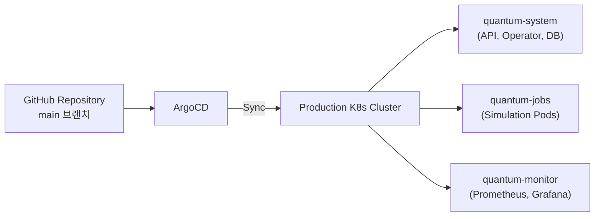

# 배포 가이드

## Prerequisites

| 도구 | 최소 버전 | 설치 |
|------|----------|------|
| Go | 1.21+ | `brew install go` |
| Python | 3.11+ | `brew install python@3.11` |
| Docker | 20+ | [Docker Desktop](https://www.docker.com/products/docker-desktop) |
| kubectl | 1.28+ | `brew install kubernetes-cli` |
| minikube | 1.31+ | `brew install minikube` |
| gh (GitHub CLI) | 2.0+ | `brew install gh` |

```bash
# 환경 확인
make check-env
```

---

## 로컬 개발 환경 (docker-compose)

가장 빠르게 API Server와 Analyzer를 실행하는 방법입니다.

### 1. Docker 이미지 빌드

```bash
make docker-build
```

개별 빌드:
```bash
docker build -t qsim-api:latest api-server/
docker build -t qsim-analyzer:latest analyzer/
docker build -t qsim-runtime:latest runtime/
```

### 2. 서비스 시작

```bash
# PostgreSQL + Redis 먼저 기동 후 API Server + Analyzer 기동
make run-local
```

또는 수동으로:
```bash
docker-compose up -d postgres redis
sleep 10  # DB 준비 대기
docker-compose up api-server analyzer
```

### 3. 서비스 확인

| 서비스 | URL |
|--------|-----|
| API Server | http://localhost:8080/health |
| Analyzer | http://localhost:8000/health |
| PostgreSQL | localhost:5432 (qsim/qsim123) |
| Redis | localhost:6379 (redis123) |

### 4. 종료

```bash
make stop-local
# 또는
docker-compose down -v  # 볼륨 포함 삭제
```

---

## minikube 개발 환경

Kubernetes 환경에서 CRD와 Operator를 테스트할 때 사용합니다.

### 1. 클러스터 셋업

`deploy/minikube/setup.sh` 스크립트가 다음을 자동으로 수행합니다:

```bash
chmod +x deploy/minikube/setup.sh
./deploy/minikube/setup.sh
```

**수행 내용:**
- minikube 클러스터 시작 (8GB 메모리, 4 CPU, 20GB 디스크, K8s v1.28.0)
- Ingress 및 metrics-server 애드온 활성화
- 네임스페이스 생성: `quantum-system`, `quantum-jobs`, `quantum-monitor`
- PostgreSQL Deployment + Service (quantum-system)
- Redis Deployment + Service (quantum-system)
- 샘플 QuantumNodeProfile CR 생성

### 2. CRD 설치

```bash
kubectl apply -f operator/config/crd/quantum.blocksq.io_quantumjobs.yaml
kubectl apply -f operator/config/crd/quantum.blocksq.io_quantumnodeprofiles.yaml
```

확인:
```bash
kubectl get crd | grep quantum
```

### 3. 컴포넌트 배포

```bash
make deploy-dev
# 또는
kubectl apply -f deploy/
```

### 4. 상태 확인

```bash
kubectl get pods -n quantum-system
kubectl get quantumjobs -n quantum-jobs
kubectl get quantumnodeprofiles -n quantum-system
minikube dashboard  # K8s 대시보드
```

### 5. 정리

```bash
make undeploy-dev
minikube stop
minikube delete  # 클러스터 완전 삭제
```

---

## Docker 이미지 상세

### API Server (`api-server/Dockerfile`)

- **빌드 스테이지**: `golang:1.21-alpine` → CGO 비활성화 정적 바이너리
- **런타임 스테이지**: `alpine:3.18` + ca-certificates
- **포트**: 8080

### Analyzer (`analyzer/Dockerfile`)

- **베이스**: `python:3.11-slim`
- **시스템 의존성**: gcc, g++ (Qiskit 빌드용)
- **Python 패키지**: FastAPI, uvicorn, Qiskit, Qiskit Aer, structlog
- **포트**: 8000

### Runtime (`runtime/Dockerfile`)

- **베이스**: `python:3.11-slim`
- **시스템 의존성**: gcc, g++, cmake, build-essential
- **Python 패키지**: Qiskit, Qiskit Aer, structlog
- **실행**: `python execute.py`

---

## Production 배포 (ArgoCD)

### 아키텍처



### 배포 전략

1. **GitOps**: `main` 브랜치의 `deploy/` 디렉토리를 ArgoCD가 감시
2. **Rolling Update**: Health check 기반 점진적 업데이트
3. **네임스페이스 분리**: system / jobs / monitoring

### 환경 변수 설정

| 변수 | 설명 | 기본값 |
|------|------|--------|
| `DB_HOST` | PostgreSQL 호스트 | `postgres` |
| `DB_PORT` | PostgreSQL 포트 | `5432` |
| `DB_USER` | PostgreSQL 사용자 | `qsim` |
| `DB_PASSWORD` | PostgreSQL 비밀번호 | - |
| `DB_NAME` | 데이터베이스 이름 | `qsim` |
| `REDIS_HOST` | Redis 호스트 | `redis` |
| `REDIS_PORT` | Redis 포트 | `6379` |
| `REDIS_PASSWORD` | Redis 비밀번호 | - |
| `LOG_LEVEL` | 로그 레벨 | `info` |

> Production에서는 K8s Secrets를 사용하여 비밀번호를 관리하세요.

### 체크리스트

- [ ] CRD 설치 완료
- [ ] PostgreSQL / Redis 프로비저닝 (외부 관리형 권장)
- [ ] S3/MinIO 버킷 생성 (`quantum-results`)
- [ ] RBAC 설정 (Operator ServiceAccount)
- [ ] Resource limits/requests 설정
- [ ] Network Policy 적용
- [ ] Ingress / TLS 설정
- [ ] Prometheus + Grafana 모니터링 구성
- [ ] ArgoCD Application 등록
